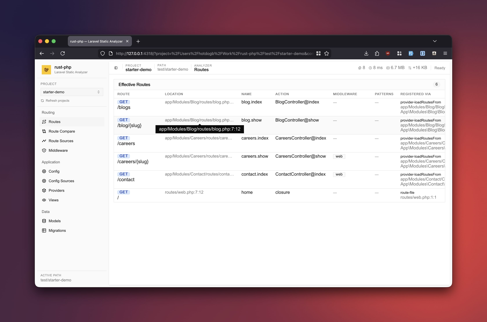

# rust-laravel

Rust analyzers for Laravel projects, built as a CLI first and shaped for future editor/LSP use.



## What This Engine Does

This project scans Laravel code statically and gives you:

- routes
- route registration sources
- config keys and env-backed values
- config registration sources
- providers
- middleware aliases, groups, and route parameter patterns

It is designed for two uses:

1. human debugging from the terminal
2. machine-readable JSON for future extension/LSP work

## Where To Put Laravel Apps

Put target Laravel projects under `laravel-example/`.

```text
rust-laravel/
  src/
  laravel-example/
    demo-app/
      app/
      config/
      routes/
      composer.json
```

Important:

- the Rust repo is the analyzer
- `laravel-example/<project>` is the target codebase
- by default, the CLI should analyze Laravel code from `laravel-example/`

## Project Resolution

When you pass `--project`:

1. if it is a real path, that path is used
2. otherwise it resolves under `./laravel-example/<name>`

When you do not pass `--project`:

1. if the current directory looks like a Laravel app, use it
2. otherwise auto-pick a single Laravel app under `./laravel-example/`

## One-Look Command Reference

| Command           | What You Get                                                                                        | Best For                                |
| ----------------- | --------------------------------------------------------------------------------------------------- | --------------------------------------- |
| `route:list`      | effective route list with method, URI, name, action, middleware, patterns, and registration summary | day-to-day route inspection             |
| `route:sources`   | route-to-provider/source attribution table                                                          | debugging where routes came from        |
| `config:list`     | effective config rows with key, env key, default, env value, and registration summary               | debugging config state                  |
| `config:sources`  | config-to-provider/source attribution table                                                         | debugging merged/package config         |
| `provider:list`   | provider graph with declaration file, kind, package, source, and status                             | debugging package/provider registration |
| `middleware:list` | middleware aliases, groups, and route patterns                                                      | debugging route enrichment              |

All commands support:

- `--project <name-or-path>`
- `--json`

## Fast Start

Development:

```bash
cargo run -- route:list --project sandbox-app
cargo run -- route:sources --project sandbox-app
cargo run -- config:list --project sandbox-app
cargo run -- config:sources --project sandbox-app
cargo run -- provider:list --project sandbox-app
cargo run -- middleware:list --project sandbox-app
```

JSON output:

```bash
cargo run -- route:list --project sandbox-app --json
cargo run -- config:list --project sandbox-app --json
cargo run -- provider:list --project sandbox-app --json
cargo run -- middleware:list --project sandbox-app --json
```

Release build:

```bash
cargo build --release
./target/release/rust-laravel route:list --project sandbox-app
./target/release/rust-laravel config:list --project sandbox-app
```

## Commands In Detail

### `route:list`

Purpose:

- show the effective routes the analyzer can see

Includes:

- `Line:Column`
- method(s)
- URI
- route name
- action
- effective middleware
- route parameter patterns
- registration summary

Example:

```bash
cargo run -- route:list --project sandbox-app
```

Use this when:

- you want the route table you would scan as a human
- you want provider-loaded routes included
- you want middleware groups/aliases expanded

### `route:sources`

Purpose:

- show where each route was registered from

Includes:

- route file location
- method and URI
- provider class if applicable
- declaration file with `Line:Column`
- registration kind such as `route-file` or `provider-loadRoutesFrom`

Example:

```bash
cargo run -- route:sources --project sandbox-app
```

Use this when:

- a route exists but you do not know which provider/package loaded it
- you are debugging service-provider behavior
- you want source attribution for LSP work

### `config:list`

Purpose:

- show the effective config rows the analyzer can derive

Includes:

- `Line:Column`
- config key
- env key
- default value
- resolved env value from `.env` or `.env.example`
- registration summary

Example:

```bash
cargo run -- config:list --project sandbox-app
```

Use this when:

- you want to inspect config state quickly in the terminal
- you want env default vs env resolved behavior
- you want package config merged through providers to appear in one view

### `config:sources`

Purpose:

- show where config came from

Includes:

- config item location
- env key
- provider class if applicable
- declaration file with `Line:Column`
- source kind such as `config-file` or `provider-mergeConfigFrom`

Example:

```bash
cargo run -- config:sources --project sandbox-app
```

Use this when:

- a config key exists but you do not know whether it is local or package-provided
- you are debugging `mergeConfigFrom(...)`
- you want config source attribution for editor tooling

### `provider:list`

Purpose:

- show which providers exist in the project graph

Includes:

- declaration `Line:Column`
- declaration file
- provider class
- registration kind
- package name if known
- resolved source file if available
- status such as `static_exact` or `source_missing`

Example:

```bash
cargo run -- provider:list --project sandbox-app
```

Use this when:

- you want to debug package discovery
- you want to see unresolved providers without requiring Composer
- you are tracing route/config behavior back to providers

### `middleware:list`

Purpose:

- show route enrichment data collected from providers

Includes:

- middleware aliases
- middleware groups
- route parameter patterns
- declaration file and `Line:Column`

Example:

```bash
cargo run -- middleware:list --project sandbox-app
```

Use this when:

- middleware on routes is confusing
- aliases or groups are hiding the real stack
- route parameter constraints affect navigation or validation

## Output Modes

### Text Mode

Designed for terminal use:

- grouped tables where that helps readability
- `Line:Column` for quick reference
- truncation with `…` on narrower terminals
- color in config output:
  - green: env value present
  - yellow: default in use
  - red: env key referenced but missing

### JSON Mode

Designed for tooling:

- stable typed report shapes
- includes file, line, column, and source metadata
- intended as the bridge to future LSP/extension work

Example:

```bash
cargo run -- route:list --project sandbox-app --json
```

## What Makes This Useful

This engine already handles more than a simple file scan:

- provider-discovered route files via `loadRoutesFrom(...)`
- provider-merged config via `mergeConfigFrom(...)`
- package code without requiring `composer install`
- missing provider/package source reported without crashing the analysis
- malformed route file recovery
- middleware alias/group expansion
- route parameter patterns

## Current Engine Surface

| Area       | Current Capability                                                                                        |
| ---------- | --------------------------------------------------------------------------------------------------------- |
| Routes     | direct route files, provider-loaded route files, names, actions, middleware, patterns, source attribution |
| Config     | direct config files, provider-merged config, env keys, defaults, resolved env values, source attribution  |
| Providers  | bootstrap registration, Composer-discovered providers, local package providers, missing-source visibility |
| Middleware | aliases, groups, route patterns                                                                           |
| Output     | terminal tables and JSON                                                                                  |

## Missing Vendor / Missing Composer Handling

This tool does not require Composer to be installed and does not require `vendor/` to be complete for baseline output.

Current behavior:

- root `composer.json` is still parsed
- package/provider declarations are still recorded
- missing source stays visible as `source_missing`
- local packages under the project can still be analyzed directly

This is important for LSP/debug workflows where the codebase may be incomplete.

## Recommended Workflow

For a new Laravel codebase:

1. put it under `laravel-example/<project>`
2. run `provider:list`
3. run `route:list`
4. run `route:sources`
5. run `config:list`
6. run `config:sources`
7. run `middleware:list`

That sequence gives you:

- provider graph
- effective routes
- route attribution
- effective config
- config attribution
- route enrichment state

## For Extension / LSP Work

The repo is being shaped so analyzers stay reusable:

- `src/analyzers/` contains extraction logic
- `src/types.rs` defines typed report contracts
- `src/output.rs` handles rendering
- `src/cli.rs` handles command parsing
- `src/lib.rs` wires commands to analyzers

This separation matters because the CLI is just one frontend. The same reports can later power:

- JSON-RPC
- editor hovers
- go-to-definition
- diagnostics
- completions
